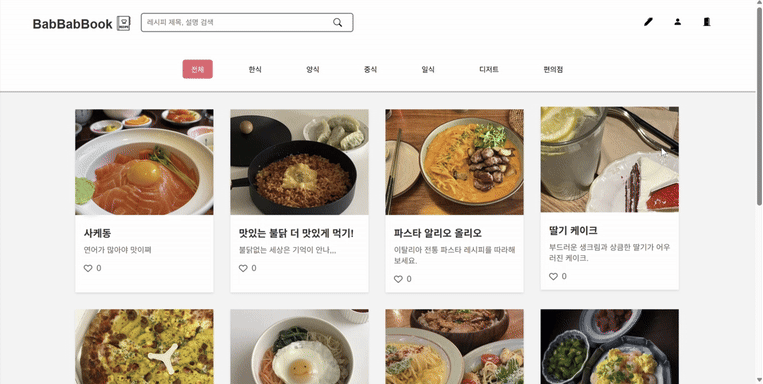
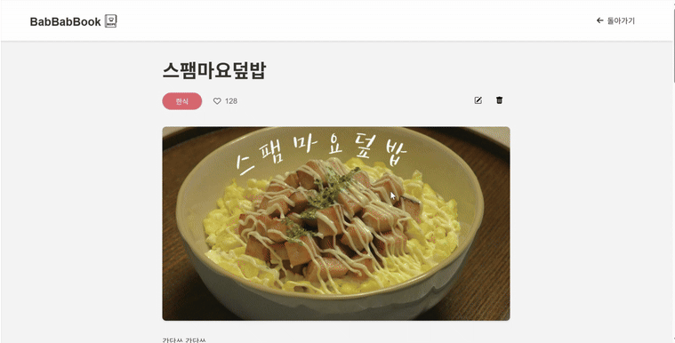
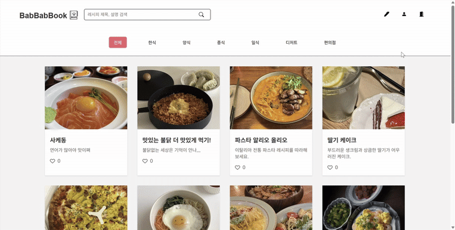
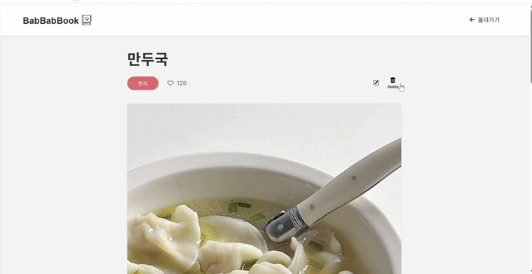

## 🍳 BabBabBook - 레시피 공유 플랫폼

**BabBabBook**은 사용자들이 직접 레시피를 작성하고, 이미지와 함께 공유할 수 있는 레시피 커뮤니티 플랫폼입니다. 카테고리 필터, 검색 기능을 통해 다양한 레시피를 탐색할 수 있습니다.

📦 배포 링크 [https://babbabbook.web.app](https://babbabbook.web.app)

 

## 🌟 프로젝트 개요

- **목표**: 간단한 CRUD 기능을 통해 요리를 좋아하는 사람들의 지식과 노하우를 쉽게 나눌 수 있는 공간 만들기
- **기간**: 2025.05.01 ~ 2025.05.14
- **기술 스택**:
  - **Frontend**: HTML, CSS, JavaScript
  - **Infra**: Firebase Realtime Database, Firebase Storage, Firebase Hosting
    
 

## 🧩 주요 기능

- 레시피 검색 : 제목, 설명으로 키워드 검색
- 카테고리 필터 : 한식, 양식, 중식 등 카테고리별 필터링
- 이미지 업로드 : Firebase Storage를 이용한 이미지 저장
- 레시피 CRUD : 레시피 생성, 수정, 삭제 기능
- 카테고리 선택 : 작성 시 레시피에 카테고리 지정 가능

 

## 🎥

> 🏠 홈화면 입니닷!

 

> 🔍 카테고리&검색을 통해 원하는 레시피를 찾아볼 수 있어요

 

> 🍽️ 레시피 상세페이지에서 자세한 레시피를 확인할 수 있어요

 

> ➕ 사진과 설명을 통해 레시피를 등록할 수 있어요

 

> ✏️ 등록한 레시피는 수정이 가능해요

 

> 🗑️ 레시피를 삭제할 수 있어요

